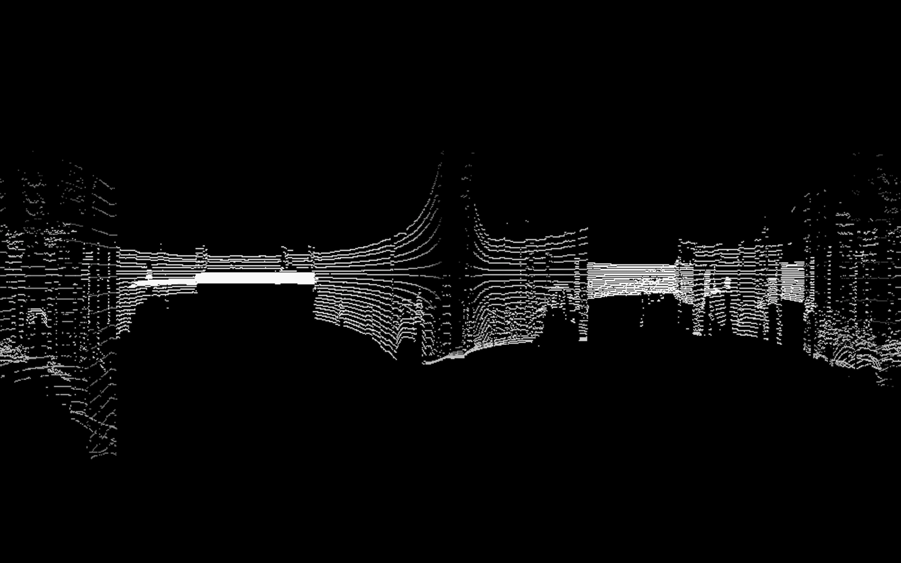
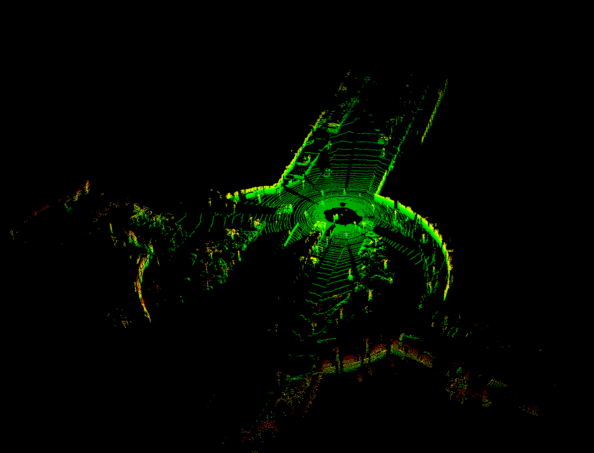
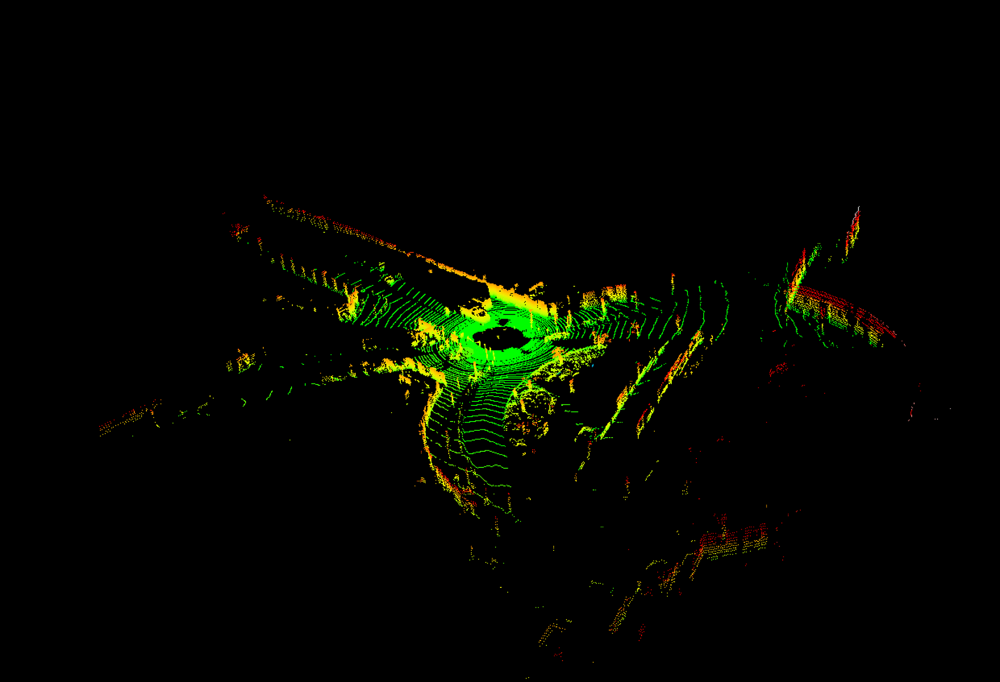
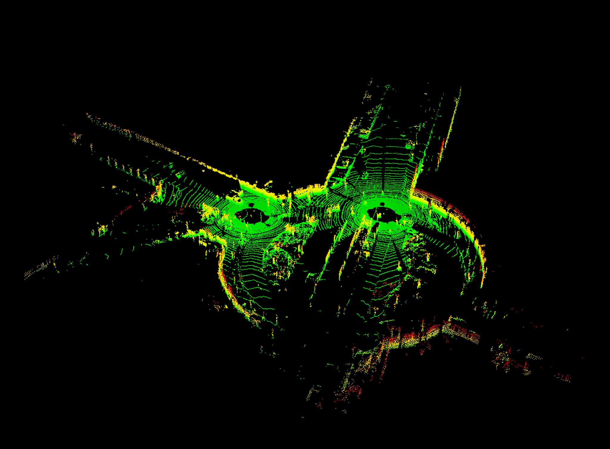

### Simultaneous Localization and Mapping for Autonomous Vehicles
Nishad Gothoskar and Cyrus Tabrizi

Figure 1: Front-facing view of LIDAR data

## Summary
We are implementing GPU-accelerated, particle-based Simultaneous Localization and Mapping (SLAM) for use in autonomous vehicles. We're using techniques from 15-418 and probabilistic robotics to process 3D LIDAR point clouds and IMU data (acceleration and rotation) from the [KITTI Vision Benchmark Suite](http://www.cvlibs.net/datasets/kitti/) in a way that improves both localization and mapping accuracy.

Figure 2: Picture of the KITTI mapping vehicle

## Major Challenges
The main hurdles come from the massive amount of data that each LIDAR collection involves. The KITTI dataset provides complete sensor data at 10Hz and each LIDAR scan returns 100,000+ 3D points in an unsorted list. Even though the work we're doing on this data is highly parallelizable, most approaches for processing all this data are memory-constrained. The pipeline for SLAM is also very deep and involves a lot of different operations, everything from applying 3D transformations to points to clustering points to sampling normal distributions for each particle in the filter. 

Deeply understanding the workload involved in doing SLAM effectively was crucial to our planning and implementation. 

For example, realizing that the LIDAR data is both precise and sparse was a reason for us to consider representing the map as a BVH-like tree structure instead of a voxel-based structure. Similarly, realizing that picking the best pose from the particle filter would involve observing the effects of small shifts informed how we decided to compute similarity scores.

## Quick summary of our SLAM algorithm
The steps for SLAM are as follows:
1. Initialize the particle filter
	1. Each particle represents a possible pose for the vehicle
	2. On the first time step, set every particle to (0,0,0,0,0,0)

2. Retrieve the LIDAR data
	1. Each scan contains roughly 100,000+ points

3. Retrieve the IMU and gyro data
	1.Remember! Relying only on IMU and gyro data introduces drift into our map.

4. Retrieve the timing data
	1. The sensor measurements are recorded at roughly 10Hz
	2. We need to know the exact timing intervals to reduce error

5. Offset each particle pose by the measured IMU and timing data
	1. We want the particles to be an estimate of where the vehicle currently is

6. Offset each particle pose by a normal distribution
	1. We'd use an actual error distribution for the timers, IMU's etc. if we had one
	2. Instead, we approximate the error as being gaussian

7. Now we use each particle pose to transform the LIDAR data back into the original reference frame

8. We compare each particle's transformed LIDAR data to the previous map and compute a similarity score

9. We search the score list and find the particle with the best score. This particle reflects our best estimate of the vehicle's true pose

10. Using our best estimate of the vehicle pose, we merge the new LIDAR data with our previous map

11. Generate a new particle filter by resampling the old particle filter, using their scores to bias the resampling towards the particles that were most accurate

12. Repeat this process

## Preliminary Results
The first step was learning the SLAM algorithm enough to first implement it all correctly from scratch. This is a necessary prerequisite to doing it in parallel. Since the problem is mostly the same in 1 dimension as it is in 3 dimensions, we first wrote a particle-based SLAM simulator in Python before moving to 3 dimensions and C++.

Figure 3: Screenshot from SLAM simulation in 1D

Simultaneously, we needed to figure out how to work with the KITTI dataset. This involves being able to read and manipulate the IMU and LIDAR data. The following shows visualizations of two LIDAR scans which have been realigned into the original reference frame. After this realignment (which includes IMU error), we were able to merge the two point clouds. The following shows that we properly transformed the data in 6 dimensions (translation and rotation in 3D).

Figure 4: Merging of two lidar scans

## What to look forward to on Friday
-Maps we've built from the KITTI dataset
-Plots of vehicle trajectory with and without SLAM
-A video showing the construction of the map as the vehicle moves through the scene